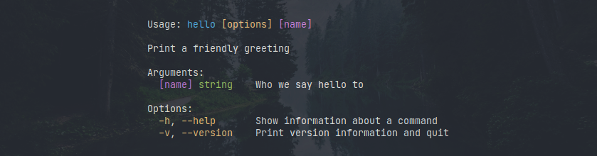

# Nice 👌

**Nice** is a highly customizable and lightweight framework for crafting CLI
apps.

Nice respects idiomatic [Go](https://golang.org/) code and focuses to be clear,
efficient and easy to write and maintain.

You can use it as a full-featured non-opinionated framework or use any nice
packages as stand-alone libraries.

I hope you'll enjoy your nice CLI app!


---

## Table of Contents

- [Hello, Nice!](#hello-nice)
- [Examples](#examples)
- [Packages](#packages)
  - [🖥️ nice/cli](#nice/cli)
  - [🖌️ nice/colors](#nice/colors)

---

## Hello, Nice!

Let's start with your first Nice CLI app.

First, install the framework:

```sh
$ go get github.com/SuperPaintman/nice/cli
```

Then put this code into a file (`hello.go` for example):

```go
package main

import "github.com/SuperPaintman/nice/cli"

func main() {
	app := cli.App{
		Name:  "hello",
		Usage: cli.Usage("Print a friendly greeting"),
		Action: cli.ActionFunc(func(cmd *cli.Command) cli.ActionRunner {
			name := cli.StringArg(cmd, "name",
				cli.Usage("Who we say hello to"),
				cli.Optional,
			)
			*name = "Nice" // Default value.

			return func(cmd *cli.Command) error {
				cmd.Printf("Hello, %s!\n", *name)

				return nil
			}
		}),
		CommandFlags: []cli.CommandFlag{
			cli.HelpCommandFlag(),
			cli.VersionCommandFlag("0.0.0"),
		},
	}

	app.HandleError(app.Run())
}
```

Now you can run it!

```sh
$ go run . world
```

Or print the help for your app:

```sh
$ go run . -h
```



---

## Examples

You can find [more examples in the `./examples` directory](./examples).

---

## Packages

<a href="#nice/cli" />

### 🖥️ `github.com/SuperPaintman/nice/cli`

```go
import "github.com/SuperPaintman/nice/cli"
```

<a href="#nice/colors" />

### 🖌️ `github.com/SuperPaintman/nice/colors`

```go
import "github.com/SuperPaintman/nice/colors"
```

---

## Tests

```sh
$ go test -race ./...
```

```sh
$ go test ./... -bench=. -benchmem -run='^Benckmark'
```

---

## Similar projects

- [flag](https://pkg.go.dev/flag) <sup>Go</sup>
- [github.com/spf13/cobra](https://github.com/spf13/cobra) <sup>Go</sup>
- [github.com/urfave/cli](https://github.com/urfave/cli) <sup>Go</sup>
- [github.com/fatih/color](https://github.com/fatih/color) <sup>Go</sup>
- [github.com/c-bata/go-prompt](https://github.com/c-bata/go-prompt) <sup>Go</sup>
- [github.com/muesli/termenv](https://github.com/muesli/termenv) <sup>Go</sup>
- [github.com/alecthomas/kingpin](https://github.com/alecthomas/kingpin) <sup>Go</sup>
- [npmjs.com/package/ervy](https://www.npmjs.com/package/ervy) <sup>JavaScript</sup>
- [npmjs.com/package/commander](https://www.npmjs.com/package/commander) <sup>JavaScript</sup>
- [npmjs.com/package/chalk](https://www.npmjs.com/package/chalk) <sup>JavaScript</sup>
- [npmjs.com/package/inquirer](https://www.npmjs.com/package/inquirer) <sup>JavaScript</sup>
- [npmjs.com/package/prompts](https://www.npmjs.com/package/prompts) <sup>JavaScript</sup>
- [npmjs.com/package/ora](https://www.npmjs.com/package/ora) <sup>JavaScript</sup>
- [npmjs.com/package/clui](https://www.npmjs.com/package/clui) <sup>JavaScript</sup>

---

#### License

[MIT](./LICENSE)

---

With 🫀 by [Aleksandr Krivoshchekov (@SuperPaintman)](https://github.com/SuperPaintman)
